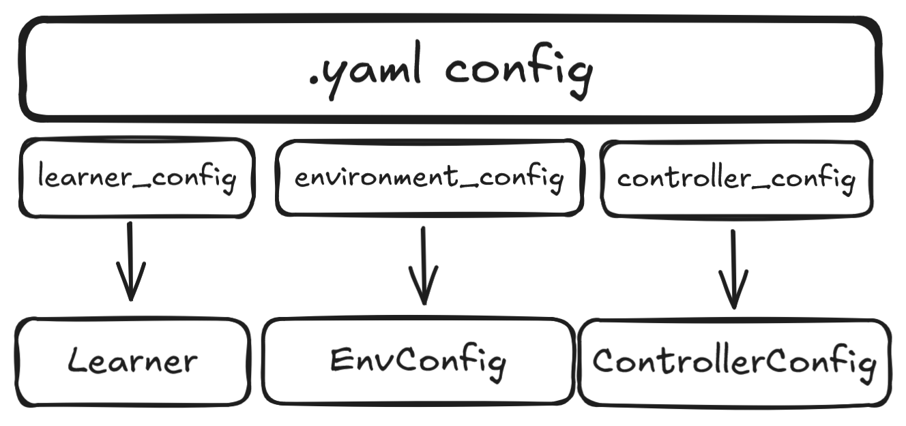

# Configurations
To run trainings, configurations are required for the ``Learner``, the ``Controller`` and the ``Environment``, all contained within a ``.yaml`` file. These parameter dictionaries are passed to the chosen ``Learner`` class, ``ControllerConfig`` and ``EnvConfig``, respectively. The ``.yaml`` file is loaded as a nested dictionary using the function ``load_config_file`` from ``src/utils/file_utils.py``. The naming convention for config files is ``algorithm_controllertype`` and to append ``_Scenario`` if it is a scenario-based training run. 

The following image shows which config dictionaries are used for which config class:

## Learner Configuration
Standard procedure is to pass all configuration dictionaries directly to the ``Learner`` class, which then initialises the environment and controllers using the respective config dictionary. All learning-related parameters should be given in the ``learner_config``. 

## EnvConfig
For modularity and compatibility, a base EnvConfig is given, from which three EnvConfigs are subclassed: 
1. ``FlatlandEnvConfig``
2. ``PettingZooEnvConfig``
3. ``GymEnvConfig``

The former is the primary ``EnvConfig`` used during development, whereas the latter two are mainly used for experimentation and allow for the testing of algorithms with standard baseline algorithms. 

:exclamation: This hasn't been exhaustively tested, use at your own risk :relaxed:

## ControllerConfig
Similarly to ``EnvConfig``, a base ``ControllerConfig`` class is given, which allows for controllers to be switched modularly within ``Learner`` and ``Worker`` classes. The class is very simple, and simply initialises the [controller class](../controllers/README.md) and returns it with the ``create_controller()`` function. 

If you want to load a controller, the ``model_name`` argument in the ``controller_config`` must be given and not empty. The model name must correspond to a folder the the ``models`` directory.