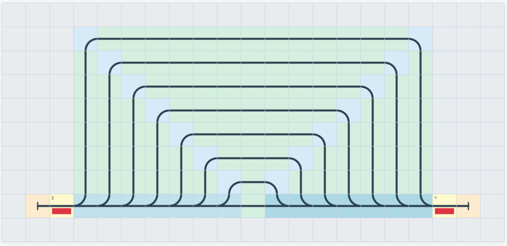
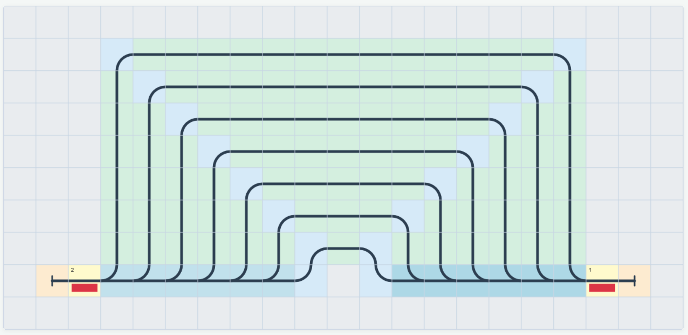
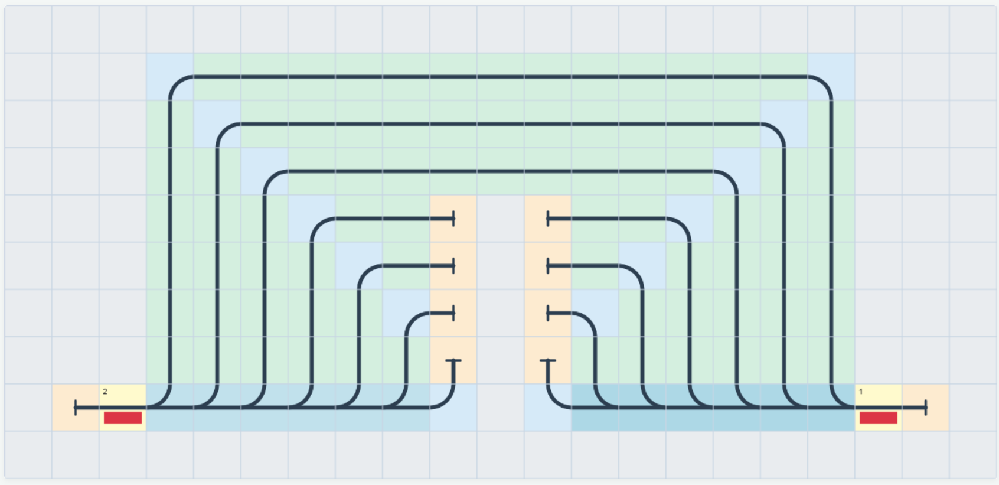
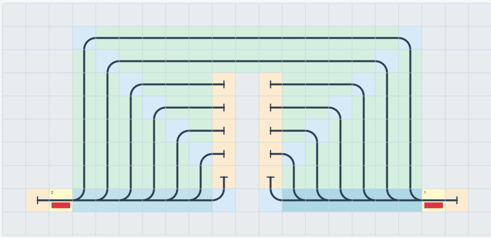
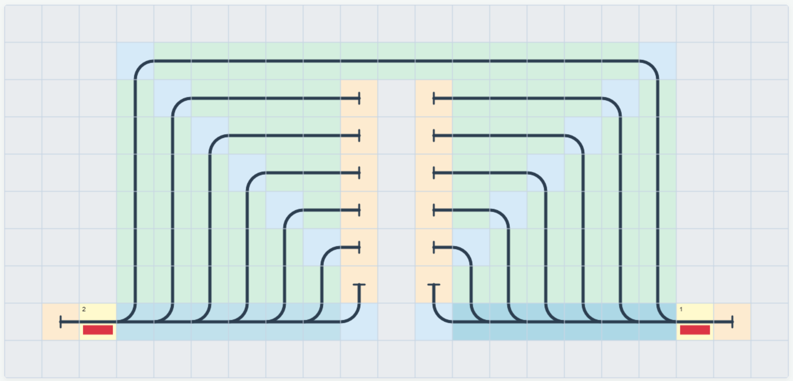

# Shortest-Path Batch Environments
The purpose of these environments is to iteratively test the shortest-route pathfinding of a single RL agent. Idea: Manuel Renold

The environments are structured such that they can be trained in succession, with 8 levels wherein the next shortest path is always removed (see renders below).

### Schedule and Delays
The schedule is defined according to the shortest path,

| Station | Latest Arrival Time         | Earliest Departure Time      |
|---------|-----------------------------|------------------------------|
| 1       | N/A                         | 0.0                         |
| 2       | 18                          | N/A                          |

Given the schedule above, the following table lists the earliest possible time of arrival given the shortest path available to the agent. 

| Level | Earliest Arrival [steps]        | Delay [steps]      |
|---------|-----------------------------|------------------------------|
| 1       | 17.6                        | - 0.4                          |
| 2       | 19.8                          | +1.8                          |
| 3       | 22.0                          | +4.0                         |
4       | 24.2                        | +6.2                          |
5       | 26.4                        | +8.4                          |
6       | 28.6                        | +10.6                          |
7       | 30.8                        | +12.8                          |
8       | 33.0                        | +15.0                          |

## Environment Topologies
Levels 1 & 2
 

Levels 3 & 4
 

Levels 5 & 6
 

Levels 7 & 8
 